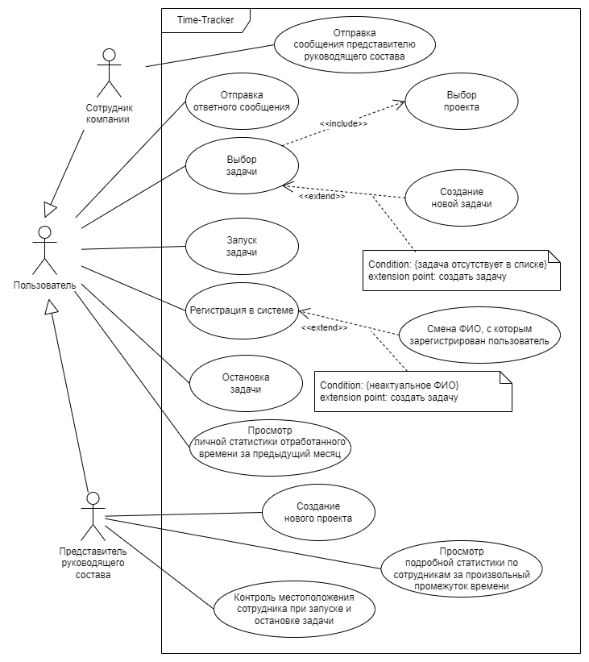

# Лабораторная работа №1
## Перечень заинтересованных лиц
|Тип|Стейкхолдер|Описание|
|-|-|-|
|Внутренние|Команда разработки|Сотрудники компании, занимающиеся непосредственно проектированием, разработкой и тестированием данного программного продукта|
|Внутренние|Начальник отдела разработки|Контролирует процесс разработки программного продукта, общается с Директором компании и потенциальными инвесторами (Компания-заказчик)|
|Внешние|Сотрудники компании|Потенциальные пользователи программного продукта, также участвуют в его тестировании в роли Сотрудников компании|
|Внешние|Начальники цехов компании|Потенциальные пользователи программного продукта, также участвуют в его тестировании в роли Представителей руководящего состава|
|Внешние|Компания-заказчик|Компания, проводящая тендер, на основании результатов которого возможно получение гранта на дальнейшую разработку и расширение проекта|
|Внешние|Другие сотрудники IT-отдела компании|Сотрудники компании, имеющие общие задачи с командой разработки, но не занимающиеся разработкой проекта (косвенно влияющие на проект)|
|Смешанные|Директор компании|Внутренний: Лицо, финансирующее проект на данном этапе. Также общается с потенциальными инвесторами (Компания-заказчик). Внешний: Потенциальный пользователь программного продукта, также участвует в его тестировании в роли Представителя руководящего состава|

## Перечень сделанных предположений
На основании посталенной задачи были сделаны следующие предположения:
1. Должна быть возможность поменять ФИО, с которым зарегистрирован пользователь (при ошибках в написании или смене ФИО).
2. Так как необходим контроль геолокации пользователя при запуске задачи, требуется поддержка клиентской части для мобильных устройств.

## Функциональные требования
Действующими лицами (Акторами, англ. Actors) ИС являются:
Сотрудник компании – рядовые сотрудники компании, которые выезжают на объекты. Для актора выделены следующие функциональные требования:
1. Выбор проекта
2. Выбор задачи
3. Создание новой задачи
4. Запуск задачи
5. Остановка задачи
6. Отправка сообщения представителю руководящего состава
7. Отправка ответных сообщений представителю руководящего состава
8. Просмотр личной статистики отработанного времени за предыдущий месяц
9. Регистрация в системе
10. Смена ФИО, с которым зарегистрирован пользователь
11. Авторизация при входе в систему

Представитель руководящего состава - директор компании, начальники участков и тд. Для актора выделены следующие функциональные требования:
1. Выбор проекта
2. Создание нового проекта
3. Выбор задачи
4. Создание новой задачи
5. Запуск задачи
6. Остановка задачи
7. Отправка ответных сообщений сотрудникам
8. Просмотр личной статистики отработанного времени за предыдущий месяц
9. Просмотр подробной статистики по сотрудникам за произвольный промежуток времени
10. Контроль местоположения сотрудника при запуске и остановке задачи
11. Регистрация в системе
10. Смена ФИО, с которым зарегистрирован пользователь
11. Авторизация при входе в систему

Исходя из потребностей действующих лиц, выделены следующие варианты использования:
1. Выбор проекта
2. Создание нового проекта
3. Выбор задачи
4. Создание новой задачи
5. Запуск задачи
6. Остановка задачи
7. Отправка сообщения представителю руководящего состава
8. Отправка ответного сообщения
9. Просмотр личной статистики отработанного времени за предыдущий месяц
10. Просмотр подробной статистики по сотрудникам за произвольный промежуток времени
11. Контроль местоположения сотрудника при запуске и остановке задачи
12. Регистрация в системе
13. Смена ФИО, с которым зарегистрирован пользователь
11. Авторизация при входе в систему

## Диаграмма вариантов использования
Описание функциональных требований выполнено с помощью диаграммы прецедентов (англ. Use Case Diagram, UCD) языка UML.

## Перечень нефункциональных требований
Далее перечислены основные нефункциональные требования, необходимые системе:
1. Сопровождаемость (Maintainability) – так как возможно расширение программного продукта на большое количество компаний, требуется заранее предусмотреть его масштабируемость и сопровождаемость.
2. Удобство и простота использования (Usability) – в связи с тем, что программным продуктом будут пользоваться низкоквалифицированные сотрудники в различных условиях окружающей среды, необходимо сделать его легко изучаемым и простым в повседневном пользовании.
3. Производительность (Performance efficiency) - в связи с тем, что программный продукт будет реализован в виде мобильного приложения, его клиентская часть должна потреблять незначительное количество ресурсов.

комментарии
добавить выбор задачи при остановке и запуске
починить отображение изображений (тег image src)