# Лабораторная работа №4
**Тема:** Проектирование REST API

**Цель работы:** Получить опыт проектирования программного интерфейса.

Код запросов представлен по расположению: "./Lab Work №4/src/TimeTracker/Controllers"
## Документация по API

### GetInitData
**метод:** GET

**описание:** получение имени текущей задачи, проекта и время начала выполнения

**параметры запроса:** 
chatId: long (идентификатор чата с пользователем в телеграмме)

**ответ:**
GetInfoEntity
- FIO: string | null (ФИО, заданное пользователем в телеграмме)
- TaskName: string (имя задачи)
- ProjectName: string (имя проекта)
- StartTime: DateTime | null (дата и время начала выполнения)

### GetProjectList
**метод:** GET

**описание:** получение списка проектов для текущего пользователя

**параметры запроса:** 
chatId: long (идентификатор чата с пользователем в телеграмме)

**ответ:**
Список DBProject
- Id: string (уникальный идентификатор проекта)
- Name: string (имя проекта)
- Description: string | null (описание проекта)

### GetTaskList
**метод:** GET

**описание:** получение списка задач для текущего пользователя

**параметры запроса:** 
chatId: long (идентификатор чата с пользователем в телеграмме)

**ответ:**
Список DBTask
- Id: string (уникальный идентификатор задачи)
- СhatId: long (идентификатор чата с пользователем в телеграмме)
- TaskName: string (имя задачи)
- TaskDescription: string (описание задачи)
- Project: DBProject (проект, к которому прикреплена задача)
	- Id: string (уникальный идентификатор проекта)
	- Name: string (имя проекта)
	- Description: string | null (описание проекта)
- StartTime: DateTime | null (время запуска задачи)
- EndTime: DateTime | null (время остановки задачи)
- StartPosition: DBGPS | null (местоположение запуска задачи)
	- Id: string (уникальный идентификатор GPS)
	- Latitude: double (широта)
	- Longitude: double (долгота)
- EndPosition: DBGPS | null (местоположение остановки задачи)
	- Id: string (уникальный идентификатор GPS)
	- Latitude: double (широта)
	- Longitude: double (долгота)

### PostNewTask
**метод:** POST

**описание:** создание новой задачи для текущего пользователя

**параметры запроса:** 
TaskEntity (объект, содержащий информацию о задаче)
- СhatId: long (идентификатор чата с пользователем в телеграмме)
- TaskName: string (имя задачи)
- TaskDescription: string (описание задачи)
- ProjectName: string (имя проекта)
- ProjectDescription: string | null (описание проекта)
- StartTime: DateTime | null (время запуска задачи)
- EndTime: DateTime | null (время остановки задачи)
- StartLatitude: double (широта)
- StartLongitude: double (долгота)
- EndLatitude: double (широта)
- EndLongitude: double (долгота)

**ответ:**
DBTask
- Id: string (уникальный идентификатор задачи)
- СhatId: long (идентификатор чата с пользователем в телеграмме)
- TaskName: string (имя задачи)
- TaskDescription: string (описание задачи)
- Project: DBProject (проект, к которому прикреплена задача)
	- Id: string (уникальный идентификатор проекта)
	- Name: string (имя проекта)
	- Description: string | null (описание проекта)
- StartTime: DateTime | null (время запуска задачи)
- EndTime: DateTime | null (время остановки задачи)
- StartPosition: DBGPS | null (местоположение запуска задачи)
	- Id: string (уникальный идентификатор GPS)
	- Latitude: double (широта)
	- Longitude: double (долгота)
- EndPosition: DBGPS | null (местоположение остановки задачи)
	- Id: string (уникальный идентификатор GPS)
	- Latitude: double (широта)
	- Longitude: double (долгота)

### PostNewProject
**метод:** POST

**описание:** создание нового проекта

**параметры запроса:** 
ProjectEntity (объект, содержащий информацию о проекте)
- ProjectName: string (имя проекта)
- ProjectDescription: string | null (описание проекта)

**ответ:**
Список DBProject
- Id: string (уникальный идентификатор проекта)
- Name: string (имя проекта)
- Description: string | null (описание проекта)

### DeleteTask
**метод:** DELETE

**описание:** удаление задачи

**параметры запроса:** 
TaskEntity (объект, содержащий информацию о задаче)
- СhatId: long (идентификатор чата с пользователем в телеграмме)
- TaskName: string (имя задачи)
- TaskDescription: string (описание задачи)
- ProjectName: string (имя проекта)
- ProjectDescription: string | null (описание проекта)
- StartTime: DateTime | null (время запуска задачи)
- EndTime: DateTime | null (время остановки задачи)
- StartLatitude: double (широта)
- StartLongitude: double (долгота)
- EndLatitude: double (широта)
- EndLongitude: double (долгота)

**ответ:**
DBTask
- Id: string (уникальный идентификатор задачи)
- СhatId: long (идентификатор чата с пользователем в телеграмме)
- TaskName: string (имя задачи)
- TaskDescription: string (описание задачи)
- Project: DBProject (проект, к которому прикреплена задача)
	- Id: string (уникальный идентификатор проекта)
	- Name: string (имя проекта)
	- Description: string | null (описание проекта)
- StartTime: DateTime | null (время запуска задачи)
- EndTime: DateTime | null (время остановки задачи)
- StartPosition: DBGPS | null (местоположение запуска задачи)
	- Id: string (уникальный идентификатор GPS)
	- Latitude: double (широта)
	- Longitude: double (долгота)
- EndPosition: DBGPS | null (местоположение остановки задачи)
	- Id: string (уникальный идентификатор GPS)
	- Latitude: double (широта)
	- Longitude: double (долгота)

### DeleteProject
**метод:** DELETE

**описание:** удаление проекта

**параметры запроса:** 
ProjectEntity (объект, содержащий информацию о проекте)
- ProjectName: string (имя проекта)
- ProjectDescription: string | null (описание проекта)

**ответ:**
Список DBProject
- Id: string (уникальный идентификатор проекта)
- Name: string (имя проекта)
- Description: string | null (описание проекта)

### PutStartTask
**метод:** PUT
**описание:** запуск задачи, при условии, что она еще не запущена

**параметры запроса:** 
TaskEntity (объект, содержащий информацию о задаче)
- СhatId: long (идентификатор чата с пользователем в телеграмме)
- TaskName: string (имя задачи)
- TaskDescription: string (описание задачи)
- ProjectName: string (имя проекта)
- ProjectDescription: string | null (описание проекта)
- StartTime: DateTime (время запуска задачи)
- EndTime: null (время остановки задачи)
- StartLatitude: double (широта)
- StartLongitude: double (долгота)
- EndLatitude: null (широта)
- EndLongitude: null (долгота)

**ответ:**
DBTask
- Id: string (уникальный идентификатор задачи)
- СhatId: long (идентификатор чата с пользователем в телеграмме)
- TaskName: string (имя задачи)
- TaskDescription: string (описание задачи)
- Project: DBProject (проект, к которому прикреплена задача)
	- Id: string (уникальный идентификатор проекта)
	- Name: string (имя проекта)
	- Description: string | null (описание проекта)
- StartTime: DateTime | null (время запуска задачи)
- EndTime: null (время остановки задачи)
- StartPosition: DBGPS | null (местоположение запуска задачи)
	- Id: string (уникальный идентификатор GPS)
	- Latitude: double (широта)
	- Longitude: double (долгота)
- EndPosition: null (местоположение остановки задачи)

### PutEndTask
**метод:** PUT

**описание:** остановка задачи при условии, что она уже запущена, но еще не остановлена

**параметры запроса:** 
TaskEntity (объект, содержащий информацию о задаче)
- СhatId: long (идентификатор чата с пользователем в телеграмме)
- TaskName: string (имя задачи)
- TaskDescription: string (описание задачи)
- ProjectName: string (имя проекта)
- ProjectDescription: string | null (описание проекта)
- StartTime: DateTime (время запуска задачи)
- EndTime: DateTime (время остановки задачи)
- StartLatitude: double (широта)
- StartLongitude: double (долгота)
- EndLatitude: double (широта)
- EndLongitude: double (долгота)

**ответ:**
DBTask
- Id: string (уникальный идентификатор задачи)
- СhatId: long (идентификатор чата с пользователем в телеграмме)
- TaskName: string (имя задачи)
- TaskDescription: string (описание задачи)
- Project: DBProject (проект, к которому прикреплена задача)
	- Id: string (уникальный идентификатор проекта)
	- Name: string (имя проекта)
	- Description: string | null (описание проекта)
- StartTime: DateTime (время запуска задачи)
- EndTime: DateTime (время остановки задачи)
- StartPosition: DBGPS (местоположение запуска задачи)
	- Id: string (уникальный идентификатор GPS)
	- Latitude: double (широта)
	- Longitude: double (долгота)
- EndPosition: DBGPS (местоположение остановки задачи)
	- Id: string (уникальный идентификатор GPS)
	- Latitude: double (широта)
	- Longitude: double (долгота)

## Тестирование API

### GetInitData
**метод:** GET

**описание:** получение имени текущей задачи, проекта и время начала выполнения

**запрос:**

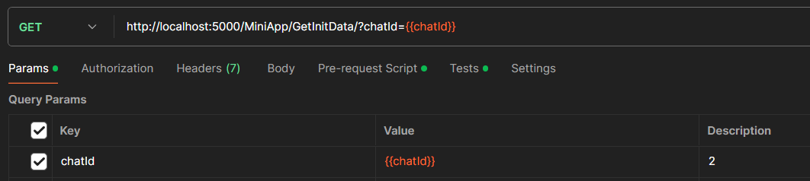

**ответ:**

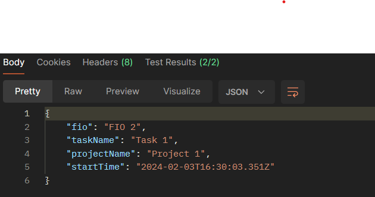

**тесты:**

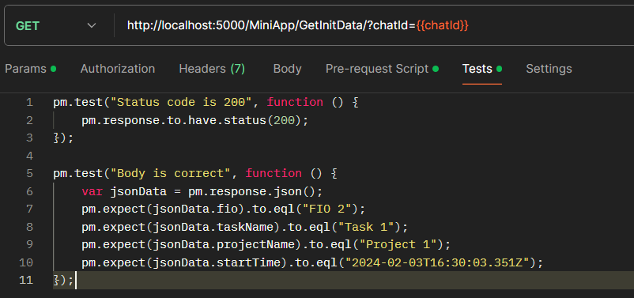

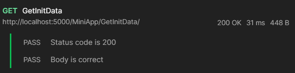

### GetProjectList
**метод:** GET

**описание:** получение списка проектов для текущего пользователя

**запрос:**

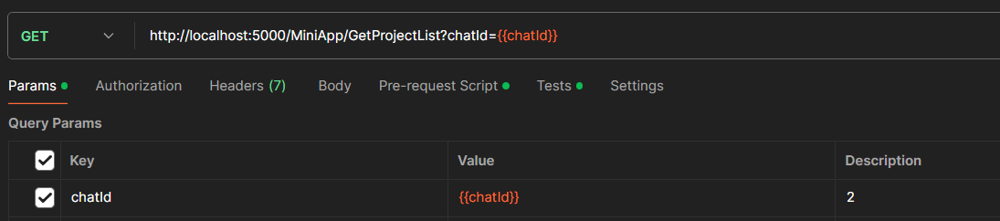

**ответ:**

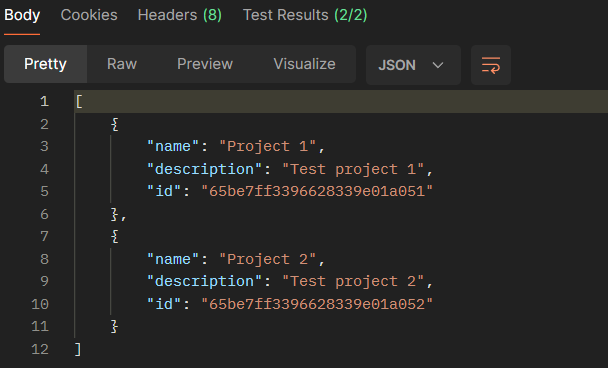

**тесты:**

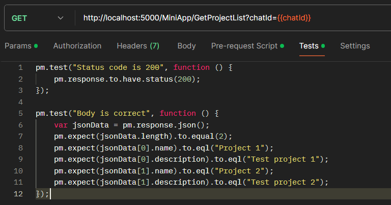

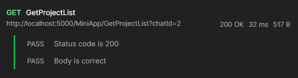

### GetTaskList
**метод:** GET

**описание:** получение списка задач для текущего пользователя

**запрос:**

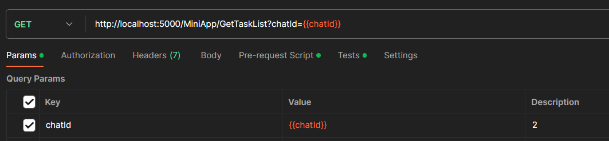

**ответ:**

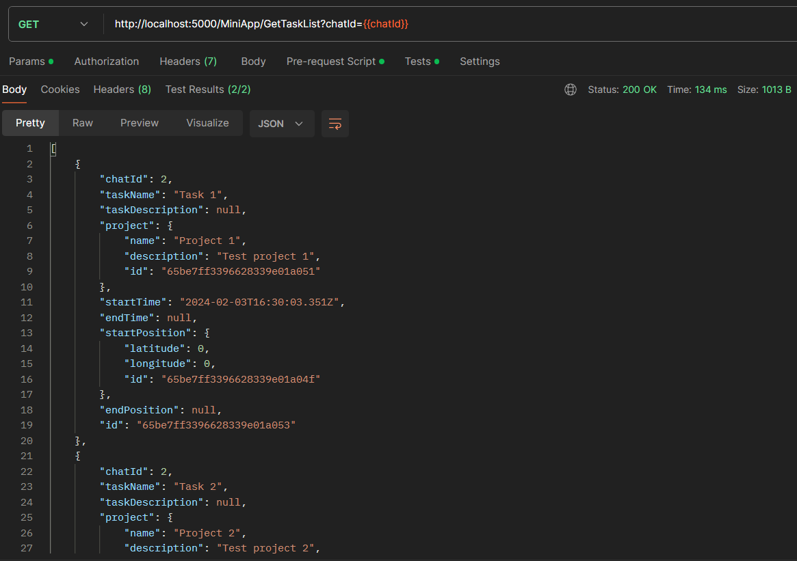

**тесты:**

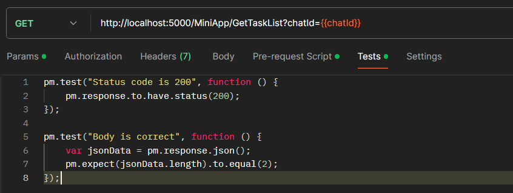

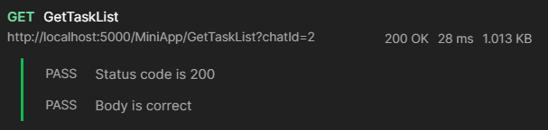

### PostNewTask
**метод:** POST

**описание:** создание новой задачи для текущего пользователя

**запрос:**

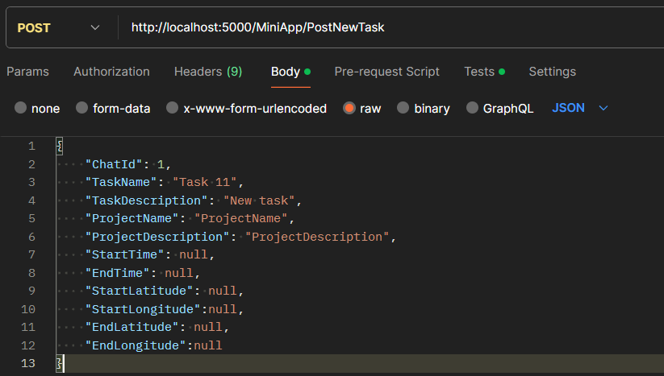

**ответ:**

**тесты:**

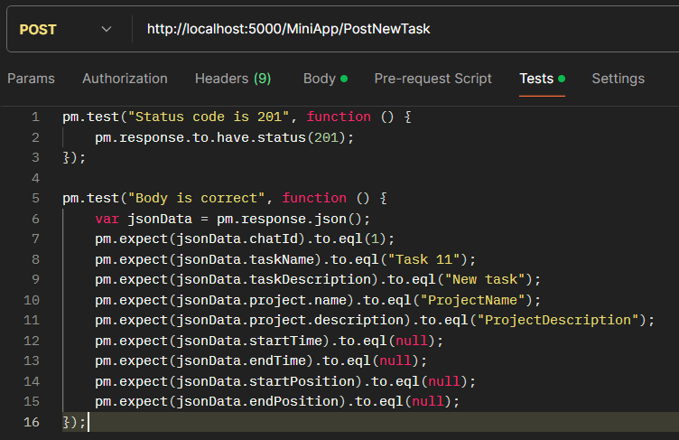

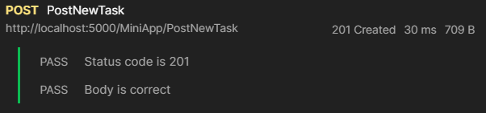

### PostNewProject
**метод:** POST

**описание:** создание нового проекта

**запрос:**

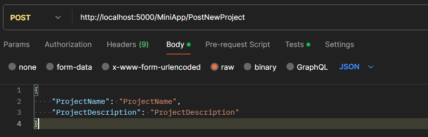

**ответ:**

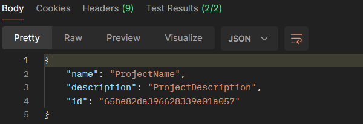

**тесты:**

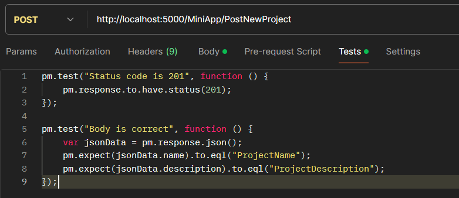

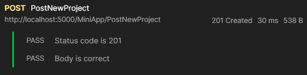

### DeleteTask
**метод:** DELETE

**описание:** удаление задачи

**запрос:**

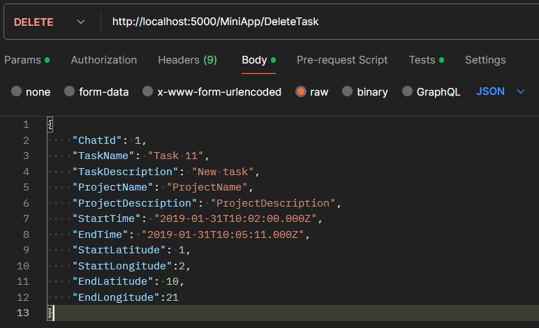

**ответ:**

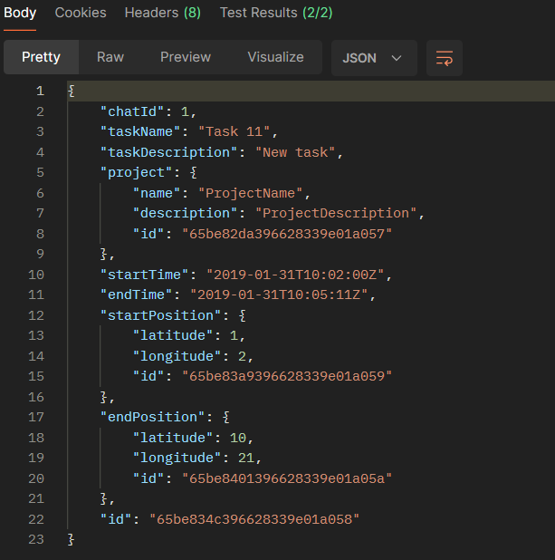

**тесты:**

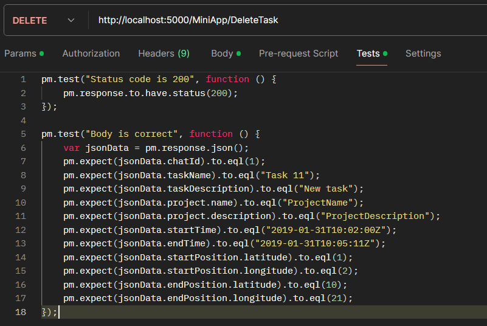

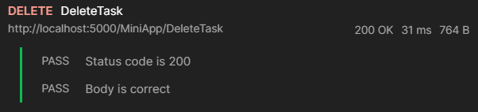

### DeleteProject
**метод:** DELETE
**описание:** удаление проекта
**запрос:**

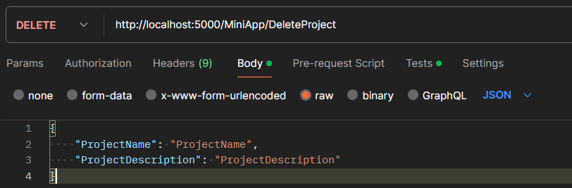

**ответ:**

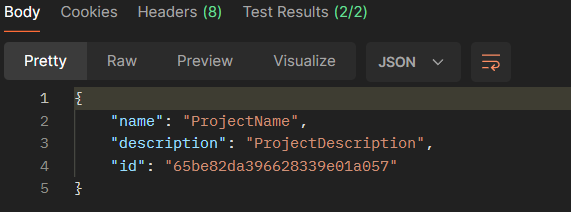

**тесты:**

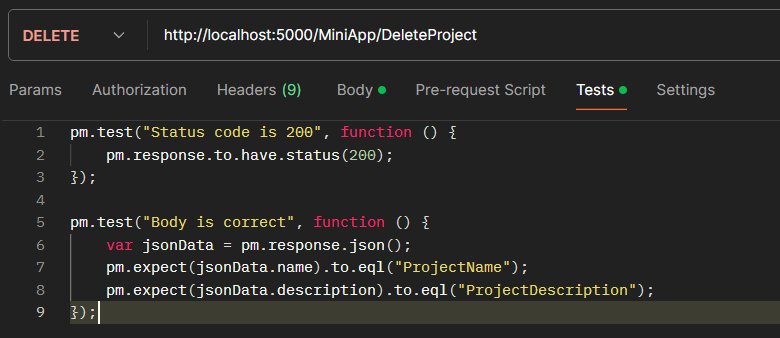

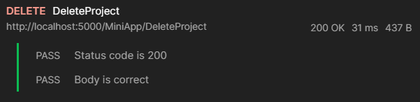

### PutStartTask
**метод:** PUT

**описание:** запуск задачи, при условии, что она еще не запущена

**запрос:**

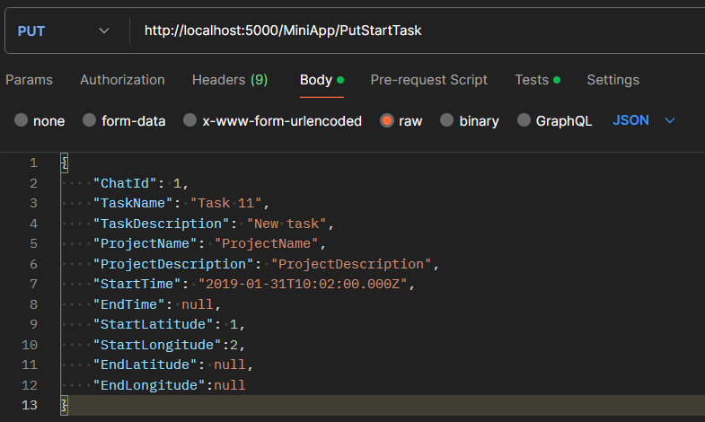

**ответ:**

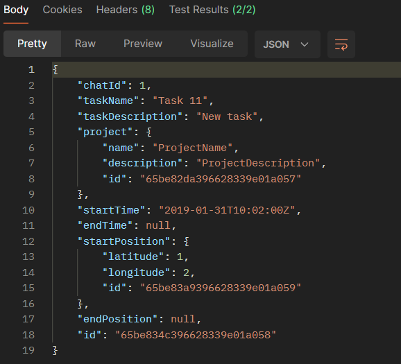

**тесты:**

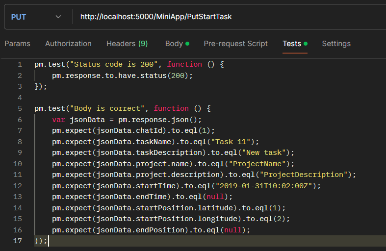

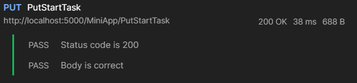

### PutEndTask
**метод:** PUT

**описание:** остановка задачи при условии, что она уже запущена, но еще не остановлена

**запрос:**

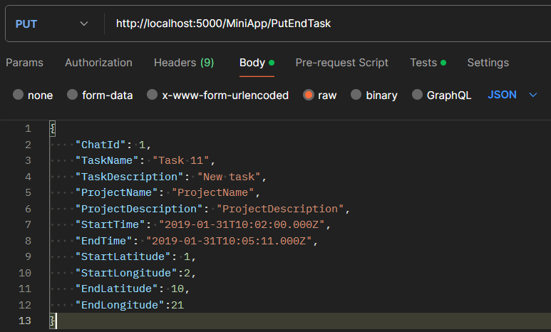

**ответ:**

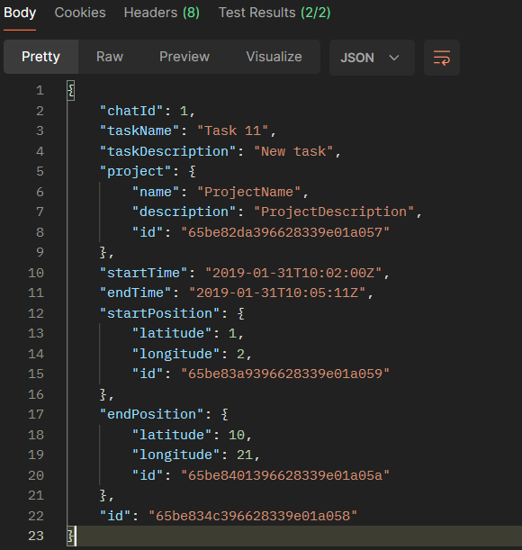

**тесты:**

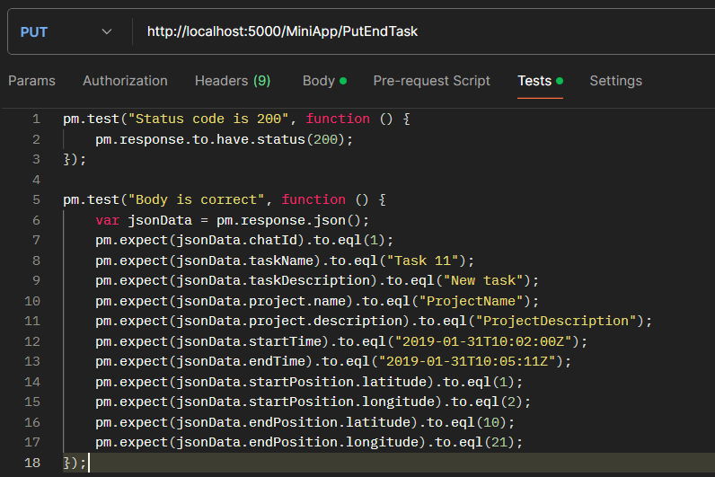

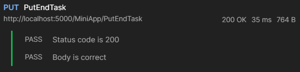

