# Лабораторная работа №6
**Тема:** Использование шаблонов проектирования

**Цель работы:** Получить опыт применения шаблонов проектирования при написании кода программной системы.

Код запросов представлен по расположению: Lab Work №6/src/

## Шаблоны проектирования GoF

### Порождающие шаблоны

#### Одиночка (Singleton)
Паттерн Одиночка используется при необходимости в единственном экземпляре класса, доступном из любого места программы.

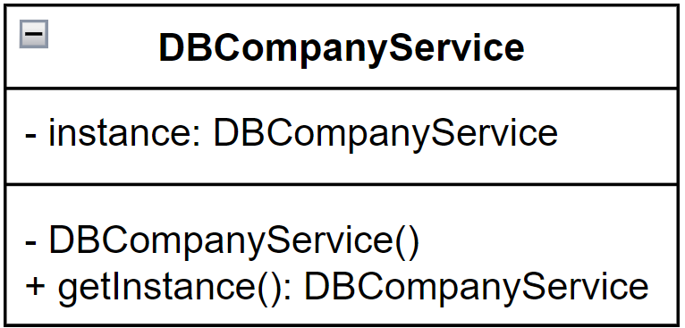

В данном случае, для DBCompanyService (как и других сервисов для взаимодействия с таблицами базы данных) нет необходимости в единственном экземпляре, однако его будет достаточно, если он будет доступен из любого места программы. 

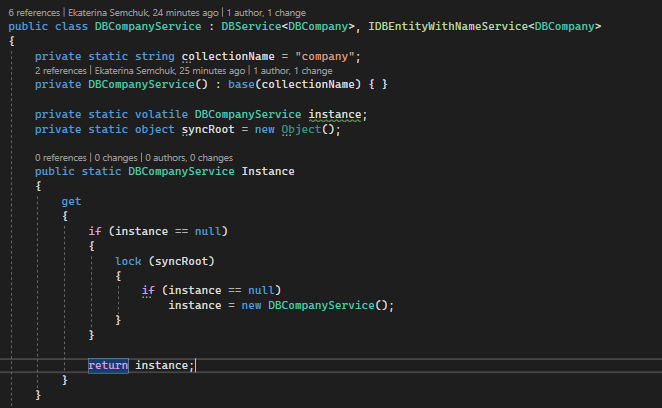

#### Прототип (Prototype)
Паттерн Прототип используется, когда есть необходимость в клонировании уже существующего объекта.
Обычно такое происходит в следующих случаях:
1.Класс порождаемого объекта определяется в момент выполнения.
2.Когда желательно избежать наследования создателя объекта.
3.Когда клонирование объекта является более предпочтительным вариантом нежели его создание и инициализация с помощью конструктора.
4.Когда создание копии объекта проще и быстрее, чем порождение его стандартным путем, используя операцию new и включая инициализацию полей.

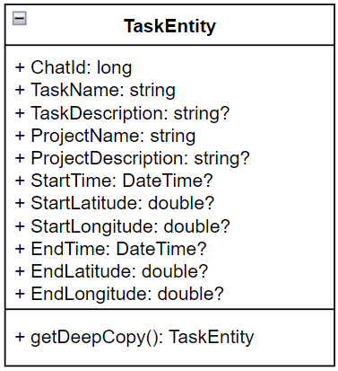

В данном случае, при работе с запуском и остановкой задач, появляется необходимость в поиске уже существующей задачи. То есть для объекта класса TaskEntity требуется найти объект, отличающийся от исходного всего двумя полями. Например, для остановки задачи, нужно найти уже запущенную, но еще не остановленную - будут отличаться поля время остановки и местоположение при остановке. Соответственно предпочтительнее клонировать исходную задачу и изменить только отличающиеся поля, чем создавать новую задачу заново.

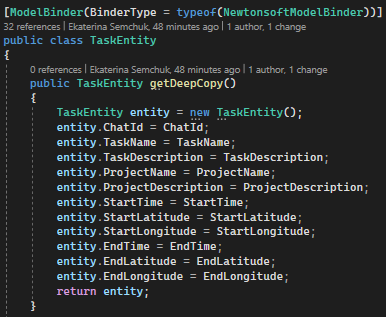

#### Строитель (Builder)
Паттерн Строитель используется, когда нужно чтобы в результате одного и того же процесса конструирования могли получаться разные представления.
Обычно такое происходит в следующих случаях:
1. Когда процесс создания нового объекта не должен зависеть от того, из каких частей этот объект состоит и как эти части связаны между собой.
2. Когда необходимо обеспечить получение различных вариаций объекта в процессе его создания.

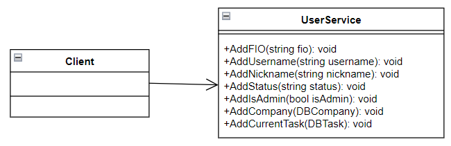

В данном случае, при регистрации нового пользователя, некоторые поля могут быть заполнены позднее по желанию пользователя. То есть, в процессе создания нового пользователя можно получить различные вариации заполненных данных.

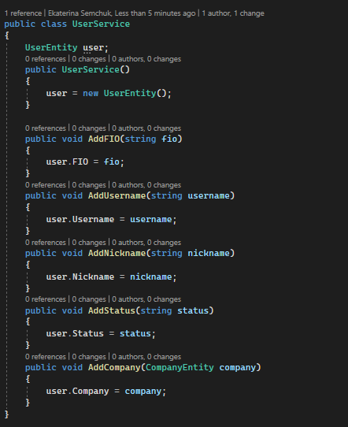

### Структурные шаблоны

#### Адаптер (Adapter)
Паттерн Адаптер используется, когда есть необходимость в совместной работе классов с несовместимыми интерфейсами.
Обычно такое происходит в следующих случаях:
1. Когда необходимо использовать имеющийся класс, но его интерфейс не соответствует потребностям бизнесс логики.
2. Когда надо использовать уже существующий класс совместно с другими классами, интерфейсы которых не совместимы.

В данном случае есть необходимость в преобразовании класса DBTask к классу TaskEntity при поиске соответствующей сущности в списке.

#### **Мост** (Bridge)
Паттерн Мост используется, когда необхоимо изменять абстракцию, и реализацию независимо друг от друга.
Обычно такое происходит в следующих случаях:
1. Когда надо избежать постоянной привязки абстракции к реализации.
2. Когда наряду с реализацией надо изменять и абстракцию независимо друг от друга. То есть изменения в абстракции не должно привести к изменениям в реализации.
В данном случае...

#### Фасад (Facade)
Паттерн Мост используется, когда есть необходимость в унифицированном интерфейсе вместо набора интерфейсов некоторой подсистемы.
Обычно такое происходит в следующих случаях:
1. Когда имеется сложная система, и необходимо упростить с ней работу. Фасад позволит определить одну точку взаимодействия между клиентом и системой.
2. Когда надо уменьшить количество зависимостей между клиентом и сложной системой. Фасадные объекты позволяют отделить, изолировать компоненты системы от клиента и развивать и работать с ними независимо.
3. Когда нужно определить подсистемы компонентов в сложной системе. Создание фасадов для компонентов каждой отдельной подсистемы позволит упростить взаимодействие между ними и повысить их независимость друг от друга.

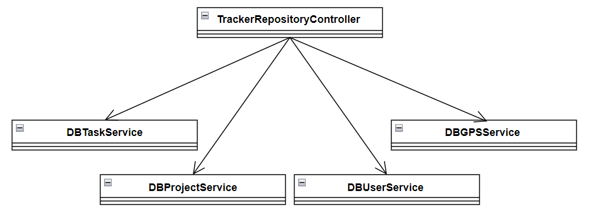

В данном случае роль фасада выполняет класс TrackerRepositoryController, упрощая взаимодействие с сервисами для получения нужной информации.

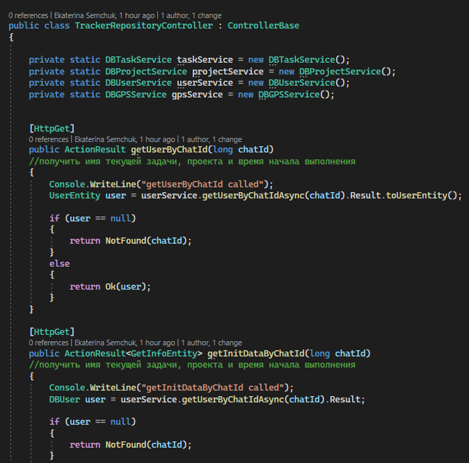

#### Заместитель (Proxy)
Паттерн Заместитель используется, когда возникает задача взаимодействия с удаленным процессом, реализация которой должна быть максимально похожей на локальное взаимодействие.

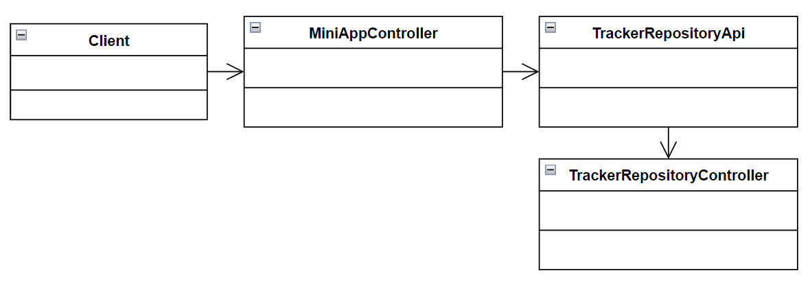

В данном случае роль заместителя выполняет класс TrackerRepositoryApi, осуществляя создание запроса и его отправку, что позволяет облегчить логику контроллера.

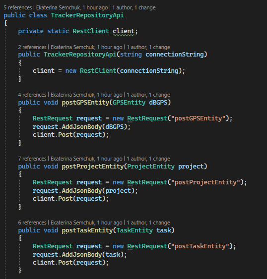

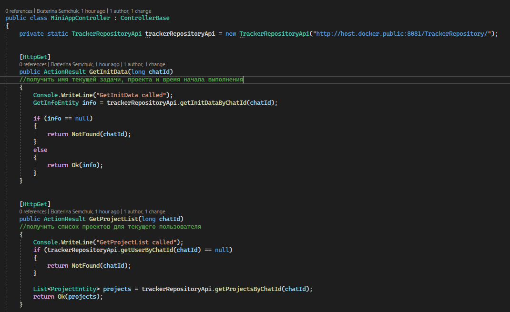

### Поведенческие шаблоны

#### Шаблонный метод (Template Method)
Паттерн Шаблонный метод используется, когда подклассам требуется переопределять некоторые шаги алгоритма, не изменяя его структуры в целом.Когда использовать шаблонный метод?
Обычно такое происходит в следующих случаях:
1. Когда планируется, что в будущем подклассы должны будут переопределять различные этапы алгоритма без изменения его структуры.
2. Когда в классах, реализующим схожий алгоритм, происходит дублирование кода. Вынесение общего кода в шаблонный метод уменьшит его дублирование в подклассах.

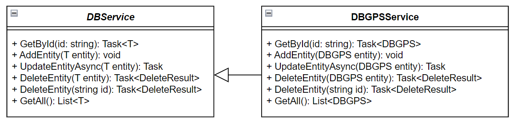

В данном случае такое происходит для сервисов взаимодействия с базой данных. Так, в абстрактном классе DBService уже определен метод поиска по Id, что позволяет избежать дублирования кода. Однако, он переопределяется для каждого наследника в зависимости от типа данных.

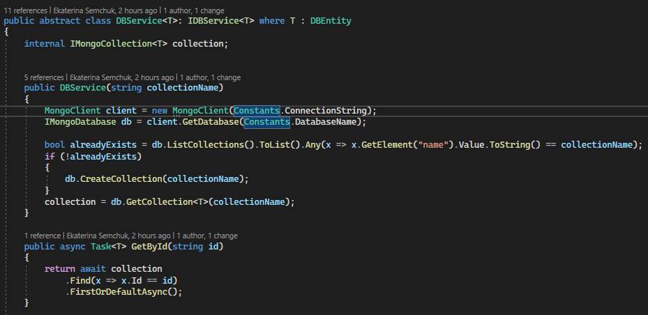

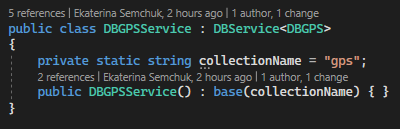

#### Интерпретатор (Interpreter)
Паттерн Шаблонный метод используется, когда необходимо интерпретировать запись в другом языке и другие похожие операции.

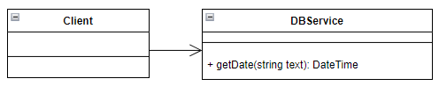

В данном случае присутствует необходимость перевода пользовательского ввода данных в формат DateTime.

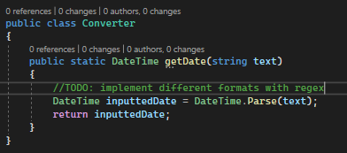

#### ???
#### ???
#### ???

## Шаблоны проектирования GRASP
<Представить с пояснения по каждому шаблону, указав:
Проблему, которую затрагивает
Решение, которое позволяет справится с проблемой
Пример фрагмента программного кода, реализующий решение
Результаты, которые при этом достигаются
Связь с другими паттернами>

### Роли (обязанности) классов
#### Создатель (Creator)
#### Контроллер (Controller)
#### Информационный эксперт (Information Expert)
#### Чистая выдумка (Pure Fabrication)
#### Посредник (Indirection)

### Принципы разработки
#### Полиморфизм (Polymorphism)
#### Низкое зацепление (Low Coupling)
#### Высокая связность (High Cohesion)

### Свойство программы (цель)
#### Устойчивость к изменениям (Protected Variations)
