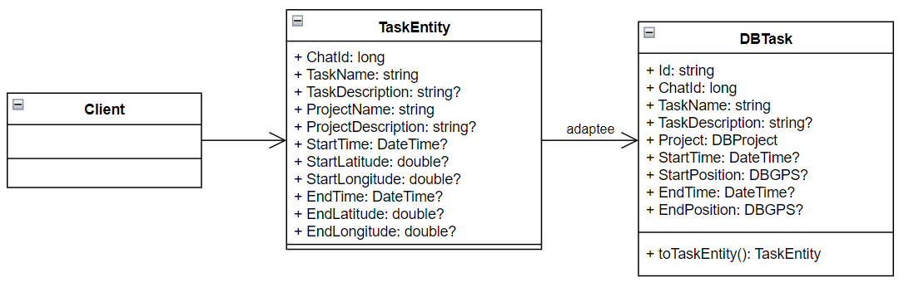
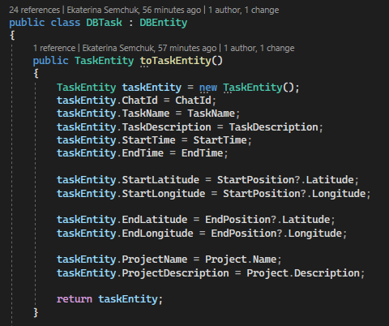
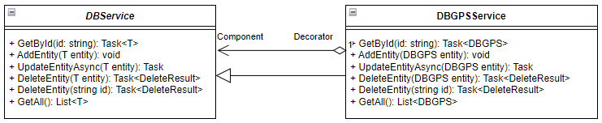
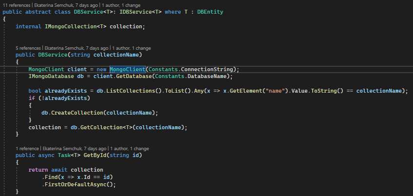
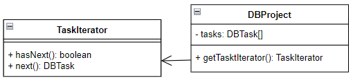
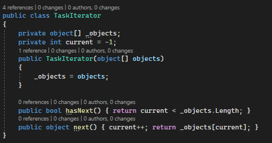
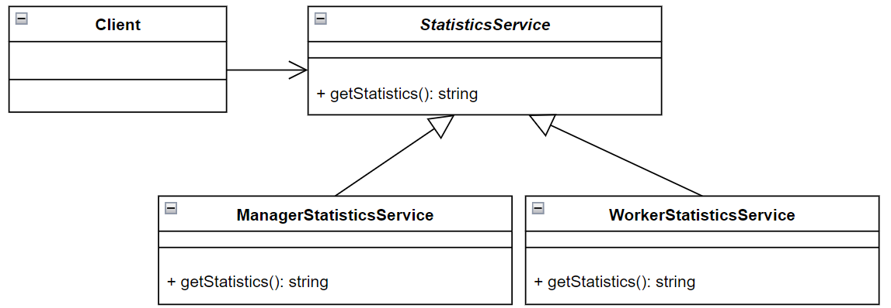
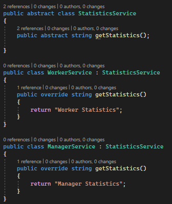

# Лабораторная работа №6
**Тема:** Использование шаблонов проектирования

**Цель работы:** Получить опыт применения шаблонов проектирования при написании кода программной системы.

Код запросов представлен по расположению: Lab Work №6/src/

## Шаблоны проектирования GoF

### Порождающие шаблоны

#### Одиночка (Singleton)
Паттерн Одиночка используется при необходимости в единственном экземпляре класса, доступном из любого места программы.

В данном случае, для DBCompanyService (как и других сервисов для взаимодействия с таблицами базы данных) нет необходимости в единственном экземпляре, однако его будет достаточно, если он будет доступен из любого места программы. 

#### Прототип (Prototype)
Паттерн Прототип используется, когда есть необходимость в клонировании уже существующего объекта.
Обычно такое происходит в следующих случаях:
1.Класс порождаемого объекта определяется в момент выполнения.
2.Когда желательно избежать наследования создателя объекта.
3.Когда клонирование объекта является более предпочтительным вариантом нежели его создание и инициализация с помощью конструктора.
4.Когда создание копии объекта проще и быстрее, чем порождение его стандартным путем, используя операцию new и включая инициализацию полей.

В данном случае, при работе с запуском и остановкой задач, появляется необходимость в поиске уже существующей задачи. То есть для объекта класса TaskEntity требуется найти объект, отличающийся от исходного всего двумя полями. Например, для остановки задачи, нужно найти уже запущенную, но еще не остановленную - будут отличаться поля время остановки и местоположение при остановке. Соответственно предпочтительнее клонировать исходную задачу и изменить только отличающиеся поля, чем создавать новую задачу заново.

#### Строитель (Builder)
Паттерн Строитель используется, когда нужно чтобы в результате одного и того же процесса конструирования могли получаться разные представления.
Обычно такое происходит в следующих случаях:
1. Когда процесс создания нового объекта не должен зависеть от того, из каких частей этот объект состоит и как эти части связаны между собой.
2. Когда необходимо обеспечить получение различных вариаций объекта в процессе его создания.

В данном случае, при регистрации нового пользователя, некоторые поля могут быть заполнены позднее по желанию пользователя. То есть, в процессе создания нового пользователя можно получить различные вариации заполненных данных.

### Структурные шаблоны

#### Адаптер (Adapter)
Паттерн Адаптер используется, когда есть необходимость в совместной работе классов с несовместимыми интерфейсами.
Обычно такое происходит в следующих случаях:
1. Когда необходимо использовать имеющийся класс, но его интерфейс не соответствует потребностям бизнесс логики.
2. Когда надо использовать уже существующий класс совместно с другими классами, интерфейсы которых не совместимы.

В данном случае есть необходимость в преобразовании класса DBTask к классу TaskEntity при поиске соответствующей сущности в списке.

#### Декоратор (Decorator)
Паттерн Декоратор используется, когда необходимо динамически добавить объекту новые обязанности.

В данном случае роль декоратора выполняет абстрактный класс DBService, динамически предоставляя новый функционал классам-наследникам, например поиск сущности по id.

#### Фасад (Facade)
Паттерн Мост используется, когда есть необходимость в унифицированном интерфейсе вместо набора интерфейсов некоторой подсистемы.
Обычно такое происходит в следующих случаях:
1. Когда имеется сложная система, и необходимо упростить с ней работу. Фасад позволит определить одну точку взаимодействия между клиентом и системой.
2. Когда надо уменьшить количество зависимостей между клиентом и сложной системой. Фасадные объекты позволяют отделить, изолировать компоненты системы от клиента и развивать и работать с ними независимо.
3. Когда нужно определить подсистемы компонентов в сложной системе. Создание фасадов для компонентов каждой отдельной подсистемы позволит упростить взаимодействие между ними и повысить их независимость друг от друга.

В данном случае роль фасада выполняет класс TrackerRepositoryController, упрощая взаимодействие с сервисами для получения нужной информации.

#### Заместитель (Proxy)
Паттерн Заместитель используется, когда возникает задача взаимодействия с удаленным процессом, реализация которой должна быть максимально похожей на локальное взаимодействие.

В данном случае роль заместителя выполняет класс TrackerRepositoryApi, осуществляя создание запроса и его отправку, что позволяет облегчить логику контроллера.

### Поведенческие шаблоны

#### Шаблонный метод (Template Method)
Паттерн Шаблонный метод используется, когда подклассам требуется переопределять некоторые шаги алгоритма, не изменяя его структуры в целом.Когда использовать шаблонный метод?
Обычно такое происходит в следующих случаях:
1. Когда планируется, что в будущем подклассы должны будут переопределять различные этапы алгоритма без изменения его структуры.
2. Когда в классах, реализующим схожий алгоритм, происходит дублирование кода. Вынесение общего кода в шаблонный метод уменьшит его дублирование в подклассах.

В данном случае такое происходит для сервисов взаимодействия с базой данных. Так, в абстрактном классе DBService уже определен метод поиска по Id, что позволяет избежать дублирования кода. Однако, он переопределяется для каждого наследника в зависимости от типа данных.

#### Интерпретатор (Interpreter)
Паттерн Шаблонный метод используется, когда необходимо интерпретировать запись в другом языке и другие похожие операции.

В данном случае присутствует необходимость перевода пользовательского ввода данных в формат DateTime.

#### Состояние (state)
Паттерн Состояние используется, когда объекту требуется варьировать свое поведение в зависимости от внутреннего состояния.
Обычно такое происходит в следующих случаях: 
1. Когда поведение объекта должно зависеть от его состояния и может изменяться динамически во время выполнения.
2. Когда в коде методов объекта используются многочисленные условные конструкции, выбор которых зависит от текущего состояния объекта.

В данном случае присутствует необходимость изменения поведения при регистрации нового пользователя. Так, изначально заносится только необходимая информация, после чего пользователь может продолжить заполнение данных о себе в произвольном порядке.

#### Итератор (Iterator)
Паттерн Итератор используется, когда нужно предоставить доступ ко всем элементам составного объекта, не раскрывая его внутреннего представления.
Обычно такое происходит в следующих случаях: 
1. Когда необходимо осуществить обход объекта без раскрытия его внутренней структуры.
2. Когда имеется набор составных объектов, и надо обеспечить единый интерфейс для их перебора.
3. Когда необходимо предоставить несколько альтернативных вариантов перебора одного и того же объекта.

В данном случае присутствует необходимость обхода существующих задач в проекте без раскрытия его внутренней структуры.

#### Стратегия (Strategy)
Паттерн Стратегия используется, когда нужно изменять алгоритмы независимо от клиентов, которые ими пользуются.
Обычно такое происходит в следующих случаях:
1. Когда есть несколько схожих классов , которые отличаются поведением. Можно задать один основной класс, а разные варианты поведения вынести в отдельные классы и при необходимости их применять.
2. Когда необходимо обеспечить выбор из нескольких вариантов решений, которые можно легко менять в зависимости от условий.
3. Когда необходимо менять поведение классов и объектов на стадии выполнения программы.
4. Когда класс, применяющий определенную функциональность, ничего не должен знать о ее реализации.

В данном случае присутствует необходимость в различном процессе предоставления информации по статистике для менеджеров и работников. Так, для менеджеров должен присутствовать выбор между статистикой для себя, для конкретного работника и для группы работников.

